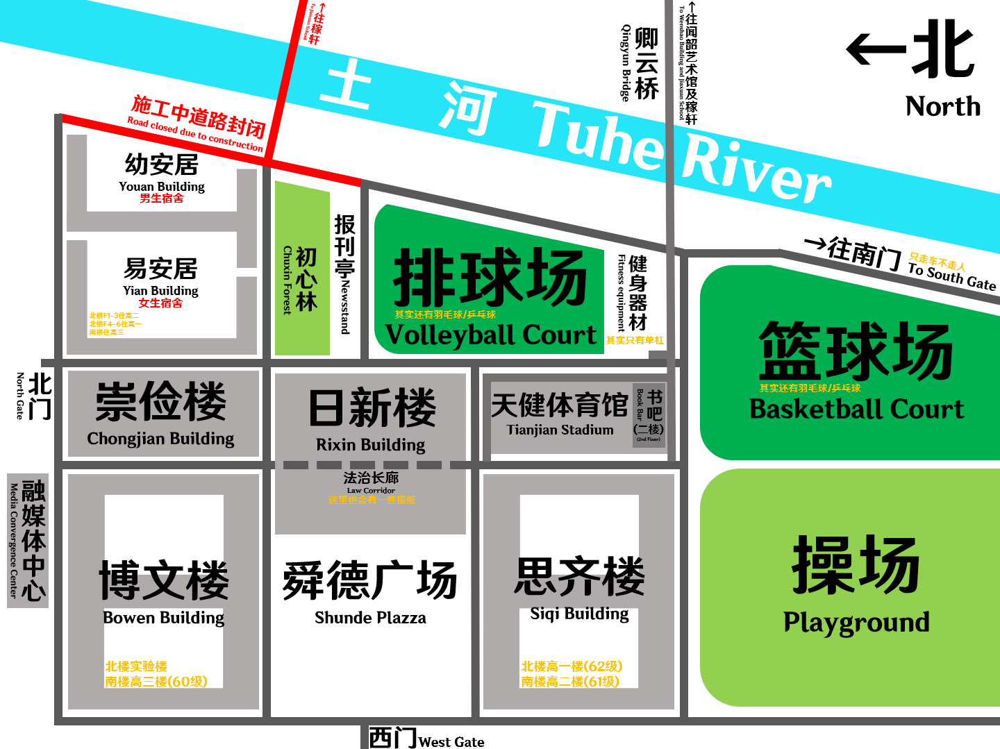

# 关于 "历城二中"

> 济南市历城第二中学，简称历城二中，是位于中华人民共和国山东省济南市历城区的一所高级中学。始建于1958年，现有唐冶、彩石两个校区。其校训为“人生在勤、志达天下”。历城二中为公立高中，同时以民办学校济南稼轩学校的名义另设小学、初中及高中部。
>
> - 摘自[维基百科](https://zh.wikipedia.org/济南市历城第二中学)

# 历城二中示意图

## 唐冶校区

